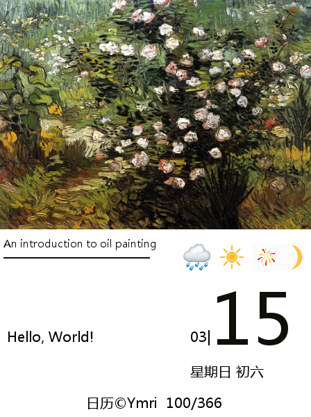

# 彩色电子日历

复刻少数派电子日历：https://sspai.com/post/82704

材料：

* 微雪彩色墨水屏5.6寸(F)600*448分辨率
* 微雪官方esp32+墨水屏驱动
* 3D打印外壳

进度:

* [x] 基础界面设计、图片生成
* [x] 爬虫批量生成图片
* [ ] esp32定时获取图片
* [ ] 服务端管理系统
* [ ] 3D打印外壳

流程：

* 客户端仅从网站下载图片然后渲染限制，所有控制操作在web端进行。
* 记录多用户用户每天获取的图片（可以直接用json数据记录）
* 记录网站/公众号更新推送，有更新（右下角提醒）
* 特殊时间（朋友生日或者某天想和对方聊天了），可以自己设置显示的内容。
* 用户可以也登录后台自己设置显示内容（句子、图片、特殊时间），支持用户自己上传图片。

### 基础界面设计

爬取数据自动生成Img,然后esp32通过http请求获取图片，~~目前不确定处理算法是在python还是esp32~~

首先把左下角话和图片全部合成，天气和日历再拼接，原版的艺术画有裸体，改成手动检查和过滤（工作量++）
代码见ImgCreate.py

数据处理全在lastImg,月份自动获取，然后放到摘要里面

全年节假日接口：https://api.apihubs.cn/holiday/get?year=2024&&cn=1&&size=366 ，直接保存到本地为`allDay.json`

二十四节气接口：https://dijizhou.100xgj.com/jieqibiao/2024 请调用`GenerateDay().my_lunar()` 保存到本地

天气接口：http://www.weather.com.cn/weather1d/101280101.shtml 更换城市id即可，天气图标显示，有一定误差

```python
    if weather == None:
        return "未知.png"
    if "晴" in weather:
        return "晴.png"
    elif "云" in weather or "阴" in weather:
        return "云.png"
    elif "雨" in weather:
        return "雨.png"
    elif "雪" in weather:
        return "雪.png"
    elif "雾" in weather or "霾" in weather:
        return "雾.png"
    elif "冰" in weather:
        return "冰.png"
    elif "沙" in weather or "尘" in weather:
        return "沙.png"
```
月亮目前只支持三种模式：
* 0-10 新月
* 11-20 满月
* 21-30 缺月

效果图如下



实物图


### 爬虫

* 从[一言](https://developer.hitokoto.cn/sentence/demo.html)获得句子（为了最佳显示效果，限制句子长度）
*
封面图，从原本[艺术油画](http://en.most-famous-paintings.com/MostFamousPaintings.nsf/ListOfTop1000MostPopularPainting?OpenForm)
切换爬取到公众号：**为你读诗**每日的推送封面

### 后台服务管理

用go写咯，目前还没开始


